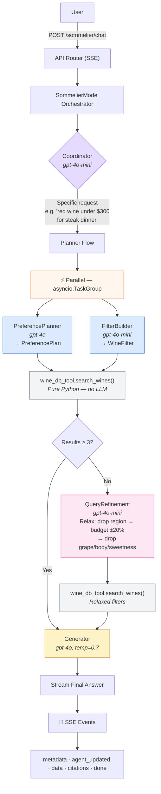
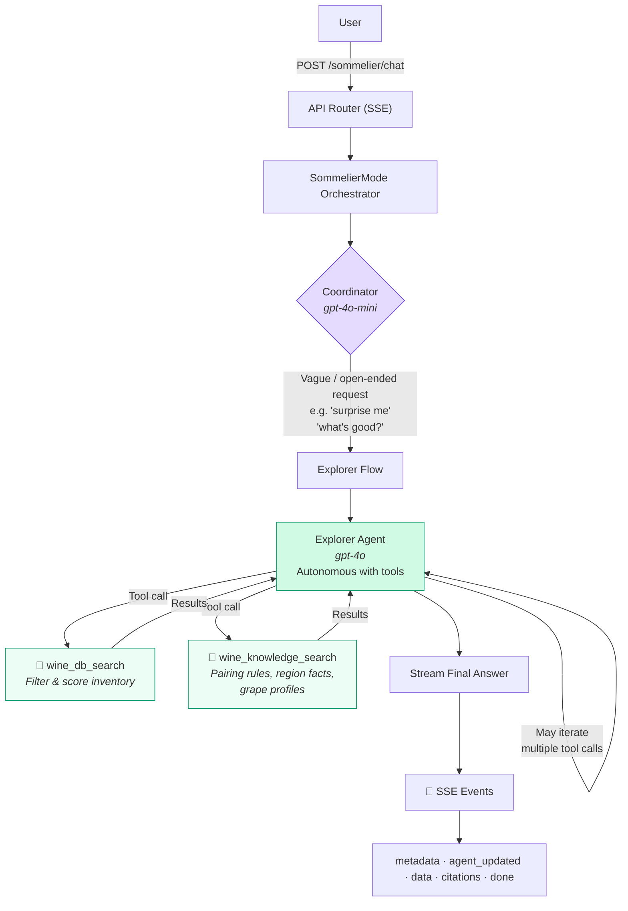

# VinoBuzz AI Sommelier

Multi-agent conversational wine recommendation system built with **FastAPI** + **OpenAI Agents SDK** + **Azure OpenAI**.

## Quick Start

```bash
# 1. Install dependencies
cd task1-wine-recommendation
poetry install
# OR: pip install -r requirements.txt

# 2. Configure Azure OpenAI
cp .env.example .env
# Edit .env with your Azure OpenAI credentials:
#   AZURE_OPENAI_API_KEY=your-key
#   AZURE_OPENAI_ENDPOINT=https://your-resource.openai.azure.com/
#   AZURE_OPENAI_API_VERSION=2024-12-01-preview

# 3. Run the server
make dev
# Server starts at http://localhost:8000

# 4. Test the API
curl -X POST http://localhost:8000/sommelier/chat \
  -H "Content-Type: application/json" \
  -d '{
    "message_history": [
      {"role": "user", "content": "I need a red wine for a business dinner, around HK$500, French if possible"}
    ]
  }'
```

## API

| Endpoint | Method | Description |
|----------|--------|-------------|
| `/sommelier/chat` | POST | Conversational wine recommendation (SSE stream) |
| `/health` | GET | Health check |

### Request Format

```json
{
  "session_id": "optional-uuid",
  "message_history": [
    {"role": "user", "content": "I'm looking for a red wine for a business dinner"},
    {"role": "assistant", "content": "What's your budget per bottle?"},
    {"role": "user", "content": "Around HK$500, French if possible"}
  ]
}
```

### Response Format

Server-Sent Events (SSE) stream:

```
event: metadata
data: {"session_id": "abc-123", "trace_id": "xyz-456"}

event: agent_updated
data: {"agent": "coordinator", "content_type": "thoughts"}

event: data
data: {"content": "Based on your preferences..."}

event: metadata
data: {"citations": [{"id": "FR-BDX-002", "name": "Chateau Leoville-Barton 2019", ...}]}

event: done
data: {"message": "Stream completed"}
```

---

## Workflow Architecture

### Planner Flow — Structured Recommendations

Triggered when the user has specific preferences (budget, occasion, region, wine type).



### Explorer Flow — Open-Ended Discovery

Triggered when the user is vague or exploratory ("surprise me", "what's good?").



### Agent Summary

| Agent | Model | Role |
|-------|-------|------|
| **Coordinator** | gpt-4o-mini | Routes to Planner or Explorer flow |
| **Preference Planner** | gpt-4o | Extracts structured preferences from conversation |
| **Filter Builder** | gpt-4o-mini | Translates preferences into search filters |
| **Generator** | gpt-4o | Builds wine recommendations or asks follow-ups |
| **Query Refinement** | gpt-4o-mini | Relaxes failed searches for retry |
| **Explorer** | gpt-4o | Handles open-ended requests autonomously |

### Model Configuration

All models are configured in `app/config/sommelier.yaml` with YAML anchors. Values must match your **Azure OpenAI deployment names**:

```yaml
model_defaults:
  heavy: &model_heavy gpt-4o          # Your Azure deployment name for GPT-4o
  light: &model_light gpt-4o-mini     # Your Azure deployment name for GPT-4o-mini
```

Change 2 lines to swap all agents to different deployments.

---

## Demo Scenarios

### Scenario 1: Specific User (Planner Flow)

```
User: "Red wine for a business dinner, around HK$500, French if possible."
AI:   "Here are my top picks:
       1. Chateau Leoville-Barton 2019 [1](#FR-BDX-002) — Classic Bordeaux, HK$480
       2. Chateau Sociando-Mallet 2018 [2](#FR-BDX-003) — Rich and structured, HK$320
       3. E. Guigal Cotes du Rhone Rouge 2020 [3](#FR-RHN-001) — Spicy dark berry, HK$140
       Would you like more details?"
```

**Flow:** Coordinator → PreferencePlanner ∥ FilterBuilder → wine_db_tool → Generator → SSE

### Scenario 2: Vague User (Explorer Flow)

```
User: "Surprise me — something for tonight, nothing fancy."
AI:   "Three picks for a relaxed evening:
       1. Trapiche Broquel Malbec 2021 [1](#AR-MEN-002) — Juicy blackberry, HK$120
       2. Louis Jadot Bourgogne Pinot Noir 2021 [2](#FR-BRG-002) — Light cherry, HK$180
       3. Jacob's Creek Reserve Shiraz 2021 [3](#AU-BAR-002) — Plum and pepper, HK$100
       What are you having for dinner? I can narrow it down!"
```

**Flow:** Coordinator → Explorer (wine_db_search + wine_knowledge_search) → SSE

---

## Design Rationale

### Decision 1: Two paths instead of one (Planner vs Explorer)

Some users say "French red under $500 for a business dinner" — they know what they want. Others say "surprise me" — they don't. A single pipeline either asks too many questions for the first group or too few for the second. So the Coordinator agent (gpt-4o-mini) reads the conversation and uses `handoff()` to route to the right flow.

- **Pro:** Each flow is optimized for its use case — Planner is fast and structured, Explorer is flexible and conversational
- **Pro:** Each path can be tested and improved independently
- **Con:** More code to maintain than a single-agent approach

### Decision 2: Application-level orchestration, not LLM-level

The Coordinator agent (gpt-4o-mini) picks the path, but everything after — parallel calls, retries, citation building — is our own Python code. Why? LLM providers update models without notice. If your workflow lives inside LLM calls, a model upgrade you didn't ask for can silently break it. We let LLMs do what they're good at (understanding preferences, writing recommendations) and keep the flow logic in code we control.

- **Pro:** Upstream model changes can't break our orchestration — only the creative parts are affected
- **Pro:** Deterministic, testable, no surprise LLM costs on plumbing
- **Con:** Adding a new flow path means writing code, not just a prompt tweak

### Decision 3: Recommend from the vendor's own selection first

Every wine vendor has their own curated inventory and taste — that's their identity. Our system always searches the vendor's own catalog first, scored and ranked against their own data (prices, tasting notes, occasion tags, ratings). The LLM never goes outside what the vendor actually carries. It writes the recommendation, but every wine it mentions is a real item from the vendor's shelf with a citation linking back to the exact record. This means the output is stable and accurate: swap the LLM model tomorrow, the wine facts don't change because they come from the vendor's data, not the LLM's training data or an internet search. If results are thin, we progressively relax filters and retry — still against the same trusted catalog.

- **Pro:** Recommendations reflect the vendor's curation and taste, not generic internet results
- **Pro:** Stable, accurate output — wine facts come from the vendor's data, not the LLM, so results stay consistent across model updates
- **Pro:** Every recommendation has a verifiable citation — zero hallucination risk
- **Con:** 2–3 LLM calls per turn adds ~2–3s vs a single call — worth it for accuracy
- **Con:** Only recommends what the vendor carries — but that's exactly the point

### Decision 4: Hardcoded inventory (demo) vs Graph-based search (production)

The current implementation uses a hardcoded wine list — good enough for demonstrating the workflow, but not how we'd run this in production.

**Current approach (this demo):** Flat list of 35 wines, scored and filtered in Python. Simple, zero-setup, no infrastructure needed.

**Production approach:** Replace the flat inventory with a **knowledge graph** (e.g. LightRAG, Neo4j, or similar graph-based RAG). Wine data naturally forms a graph — a wine *is from* a region, *pairs with* a food, *is made from* a grape, a grape *thrives in* a climate, a region *is known for* a style. A graph captures these relationships, so when a user asks "something like that Bordeaux but lighter," the system traverses the graph (Bordeaux → full-bodied → find lighter-bodied neighbors) instead of relying on keyword matching or LLM reasoning. This means:

- **Better recall:** Graph traversal finds wines connected by relationships that flat filters miss (e.g. "wines similar to X" or "what pairs with Y in a Z occasion")
- **Vendor knowledge encoded once:** The vendor's expertise — which wines they pair together, which they recommend for specific occasions, how they group their collection — lives in the graph as edges, not as prompt engineering
- **Scales with catalog size:** Flat-list scoring breaks down at 500+ wines; graph search stays fast via indexed traversal
- **Hybrid retrieval:** Combine graph traversal (structural similarity) with vector search (semantic similarity) for the best of both worlds

The current `wine_db_tool` interface stays the same — swap the implementation behind `search_wines()` from list filtering to graph query. The orchestration layer doesn't change at all.

- **Pro (current):** Zero setup, runs anywhere with just an API key
- **Pro (production):** Graph search captures wine relationships that flat filters and LLMs cannot reliably reason about
- **Con (current):** Sessions lost on restart, inventory is static — both designed for easy swap (Redis, graph DB)

---

## Testing

### Unit Tests (no LLM required)

```bash
make test    # Run all 37 tests
make lint    # Lint check
make format  # Auto-format
```

### Integration Testing with LLM (Postman)

A Postman collection is provided at `postman/VinoBuzz_Sommelier.postman_collection.json` with 11 pre-built requests across 4 scenarios.

**Setup:**
```bash
# 1. Configure credentials
cp .env.example .env
# Edit .env with your Azure OpenAI (or standard OpenAI) credentials

# 2. Start the server
make dev

# 3. Import into Postman
#    File → Import → select postman/VinoBuzz_Sommelier.postman_collection.json
```

**Scenarios included:**

| # | Scenario | Flow Tested | Requests |
|---|----------|-------------|----------|
| 1 | Specific request (French red, budget, occasion) | Planner | 3 requests (single-turn, multi-turn, tight budget) |
| 2 | Vague request ("surprise me", knowledge questions) | Explorer | 3 requests |
| 3 | Edge cases (minimal info, impossible filters, i18n) | Follow-up / Relaxation | 4 requests |
| 4 | Long conversation (3+ turns, preference updates) | Multi-turn Planner | 2 requests |

**Note:** Since the API returns SSE (Server-Sent Events), in Postman you'll see the raw event stream. Each event is prefixed with `event:` and `data:` lines. Look for:
- `event: agent_updated` — shows which agent is active
- `event: data` — the recommendation text with `[n](#SKU)` citations
- `event: metadata` — parsed citations with wine details
- `event: done` — stream complete

**Alternative — curl (no Postman needed):**
```bash
# Scenario 1: Specific request
curl -N -X POST http://localhost:8000/sommelier/chat \
  -H "Content-Type: application/json" \
  -d '{"message_history": [{"role": "user", "content": "Red wine for business dinner, HK$500, French"}]}'

# Scenario 2: Vague request
curl -N -X POST http://localhost:8000/sommelier/chat \
  -H "Content-Type: application/json" \
  -d '{"message_history": [{"role": "user", "content": "Surprise me with something interesting"}]}'
```

## Project Structure

```
postman/
└── VinoBuzz_Sommelier.postman_collection.json  # 11 requests, 4 scenarios
app/
├── main.py                          # FastAPI app + health check
├── settings.py                      # Environment config
├── config/sommelier.yaml            # Agent model/temperature config
├── api/routers/sommelier.py         # POST /sommelier/chat endpoint
├── biz/
│   ├── agent/sommelier/
│   │   ├── mode.py                  # SommelierMode orchestrator
│   │   ├── agents/                  # 6 specialized agents
│   │   ├── schemas/                 # Pydantic structured outputs
│   │   └── utils/citation.py       # Citation parser
│   └── tools/
│       ├── wine_db_tool.py          # Inventory search/filter/score
│       └── web_search_tool.py       # Wine knowledge lookup
├── core/
│   ├── models.py                    # Request/response schemas
│   ├── streaming.py                 # SSE event formatting
│   └── chat_interface.py            # Agent runner with retry
├── data/
│   ├── wines.py                     # 35 hardcoded wines
│   └── wine_knowledge.py            # Pairing rules, region facts
└── prompts/                         # Agent system prompts (Markdown)
```
