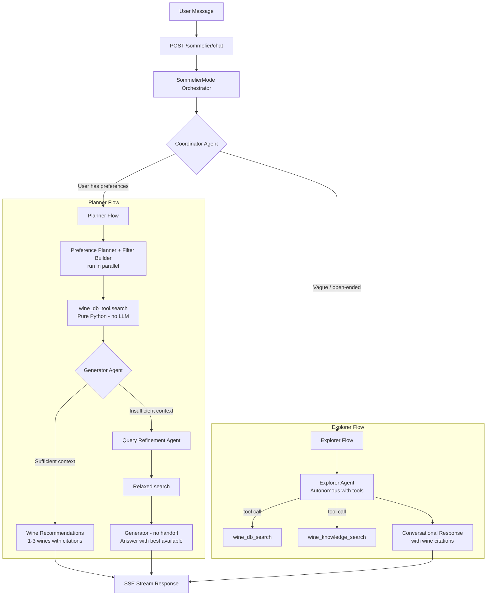

# VinoBuzz AI Sommelier

Multi-agent conversational wine recommendation system built with **FastAPI** + **OpenAI Agents SDK** + **Azure OpenAI**.

## Quick Start

```bash
# 1. Install dependencies
cd task1-wine-recommendation
poetry install
# OR: pip install -r requirements.txt

# 2. Configure Azure OpenAI
cp .env.example .env
# Edit .env with your Azure OpenAI credentials:
#   AZURE_OPENAI_API_KEY=your-key
#   AZURE_OPENAI_ENDPOINT=https://your-resource.openai.azure.com/
#   AZURE_OPENAI_API_VERSION=2024-12-01-preview

# 3. Run the server
make dev
# Server starts at http://localhost:8000

# 4. Test the API
curl -X POST http://localhost:8000/sommelier/chat \
  -H "Content-Type: application/json" \
  -d '{
    "message_history": [
      {"role": "user", "content": "I need a red wine for a business dinner, around HK$500, French if possible"}
    ]
  }'
```

## API

| Endpoint | Method | Description |
|----------|--------|-------------|
| `/sommelier/chat` | POST | Conversational wine recommendation (SSE stream) |
| `/health` | GET | Health check |

### Request Format

```json
{
  "session_id": "optional-uuid",
  "message_history": [
    {"role": "user", "content": "I'm looking for a red wine for a business dinner"},
    {"role": "assistant", "content": "What's your budget per bottle?"},
    {"role": "user", "content": "Around HK$500, French if possible"}
  ]
}
```

### Response Format

Server-Sent Events (SSE) stream:

```
event: metadata
data: {"session_id": "abc-123", "trace_id": "xyz-456"}

event: agent_updated
data: {"agent": "coordinator", "content_type": "thoughts"}

event: data
data: {"content": "Based on your preferences..."}

event: metadata
data: {"citations": [{"id": "FR-BDX-002", "name": "Chateau Leoville-Barton 2019", ...}]}

event: done
data: {"message": "Stream completed"}
```

---

## Workflow Architecture



### Agent Summary

| Agent | Model | Role |
|-------|-------|------|
| **Coordinator** | gpt-4o-mini | Routes to Planner or Explorer flow |
| **Preference Planner** | gpt-4o | Extracts structured preferences from conversation |
| **Filter Builder** | gpt-4o-mini | Translates preferences into search filters |
| **Generator** | gpt-4o | Builds wine recommendations or asks follow-ups |
| **Query Refinement** | gpt-4o-mini | Relaxes failed searches for retry |
| **Explorer** | gpt-4o | Handles open-ended requests autonomously |

### Model Configuration

All models are configured in `app/config/sommelier.yaml` with YAML anchors. Values must match your **Azure OpenAI deployment names**:

```yaml
model_defaults:
  heavy: &model_heavy gpt-4o          # Your Azure deployment name for GPT-4o
  light: &model_light gpt-4o-mini     # Your Azure deployment name for GPT-4o-mini
```

Change 2 lines to swap all agents to different deployments.

---

## Demo Scenarios

### Scenario 1: Specific User (Planner Flow)

```
User: "I'm looking for a red wine for a business dinner."
AI:   "What's your budget per bottle, and do you have any regional preferences?"
User: "Around HK$500, preferably French."
AI:   "Based on your preferences for a French red under HK$500 for a business dinner,
       here are my top picks:

       1. **Chateau Leoville-Barton 2019** [1](#FR-BDX-002) — A classic Saint-Julien
          Bordeaux with blackcurrant and cedar notes. At HK$480, it signals good taste
          at a business dinner.

       2. **Chateau Sociando-Mallet 2018** [2](#FR-BDX-003) — Rich and well-structured
          with ripe tannins. At HK$320, excellent value for a respected Bordeaux label.

       3. **E. Guigal Cotes du Rhone Rouge 2020** [3](#FR-RHN-001) — Spicy dark berry
          with peppery notes. At HK$140, a great everyday option if you need multiple
          bottles.

       Would you like more details, or shall I look for something different?"
```

**Flow:** Coordinator → Planner → PreferencePlanner ∥ FilterBuilder → wine_db_tool → Generator → SSE response

### Scenario 2: Vague User (Explorer Flow)

```
User: "Surprise me — something for tonight, nothing fancy."
AI:   "Here are three great picks for a relaxed evening:

       1. **Trapiche Broquel Malbec 2021** [1](#AR-MEN-002) — Juicy blackberry and plum
          with a hint of vanilla. At HK$120, it's an easy-drinking crowd-pleaser.

       2. **Louis Jadot Bourgogne Pinot Noir 2021** [2](#FR-BRG-002) — Light cherry
          and raspberry, smooth and approachable. HK$180 for genuine Burgundy.

       3. **Jacob's Creek Reserve Barossa Shiraz 2021** [3](#AU-BAR-002) — Plum and
          pepper with smooth vanilla finish. Just HK$100 — perfect casual wine.

       Any of these catch your eye? Or tell me what you're having for dinner and
       I'll narrow it down!"
```

**Flow:** Coordinator → Explorer (with wine_db_search tool calls) → SSE response

---

## Design Rationale (300 words)

**Why dual-path multi-agent architecture?**

Wine recommendation has two fundamentally different user modes: users who know what they want ("French red, $500, business dinner") and users who don't ("surprise me"). A single-path system forces compromise — either too many questions for specific users or too few for vague ones. Our dual-path design (Planner Flow vs Explorer Flow) handles both optimally, inspired by production patterns in enterprise search systems.

**Why a Python orchestrator, not an LLM orchestrator?**

The routing decision (structured vs autonomous) is deterministic enough for a lightweight Coordinator Agent. But the flow execution — parallel agent calls, retry logic, citation building — is pure Python in `SommelierMode.run()`. This keeps latency low (no extra LLM calls for plumbing) and makes the system testable and debuggable.

**Why pre-compute context, then inject?**

Rather than having the Generator Agent call search tools at runtime, we run PreferencePlanner + FilterBuilder → search → inject results into Generator's system prompt. This mirrors production RAG patterns: the Generator sees pre-retrieved context and focuses purely on response quality. It also enables the retry path — if context is insufficient, QueryRefinement transforms queries and re-searches before a second Generator pass.

**Why hardcoded inventory?**

The assignment says "the focus is on workflow design, not real inventory." Our `wine_db_tool` has the same interface whether backed by a Python list or PostgreSQL — the search/filter/score logic is identical. The hardcoded data lets us demo without infrastructure dependencies while keeping the architecture production-ready.

**Trade-offs:**
- 2-3 LLM calls per turn adds ~2-3s latency vs single-call — acceptable for recommendation quality
- Dual-path means more code than single-agent — but each path is independently testable
- In-memory sessions lost on restart — intentional for simplicity, designed for Redis swap

---

## Testing

### Unit Tests (no LLM required)

```bash
make test    # Run all 37 tests
make lint    # Lint check
make format  # Auto-format
```

### Integration Testing with LLM (Postman)

A Postman collection is provided at `postman/VinoBuzz_Sommelier.postman_collection.json` with 11 pre-built requests across 4 scenarios.

**Setup:**
```bash
# 1. Configure credentials
cp .env.example .env
# Edit .env with your Azure OpenAI (or standard OpenAI) credentials

# 2. Start the server
make dev

# 3. Import into Postman
#    File → Import → select postman/VinoBuzz_Sommelier.postman_collection.json
```

**Scenarios included:**

| # | Scenario | Flow Tested | Requests |
|---|----------|-------------|----------|
| 1 | Specific request (French red, budget, occasion) | Planner | 3 requests (single-turn, multi-turn, tight budget) |
| 2 | Vague request ("surprise me", knowledge questions) | Explorer | 3 requests |
| 3 | Edge cases (minimal info, impossible filters, i18n) | Follow-up / Relaxation | 4 requests |
| 4 | Long conversation (3+ turns, preference updates) | Multi-turn Planner | 2 requests |

**Note:** Since the API returns SSE (Server-Sent Events), in Postman you'll see the raw event stream. Each event is prefixed with `event:` and `data:` lines. Look for:
- `event: agent_updated` — shows which agent is active
- `event: data` — the recommendation text with `[n](#SKU)` citations
- `event: metadata` — parsed citations with wine details
- `event: done` — stream complete

**Alternative — curl (no Postman needed):**
```bash
# Scenario 1: Specific request
curl -N -X POST http://localhost:8000/sommelier/chat \
  -H "Content-Type: application/json" \
  -d '{"message_history": [{"role": "user", "content": "Red wine for business dinner, HK$500, French"}]}'

# Scenario 2: Vague request
curl -N -X POST http://localhost:8000/sommelier/chat \
  -H "Content-Type: application/json" \
  -d '{"message_history": [{"role": "user", "content": "Surprise me with something interesting"}]}'
```

## Project Structure

```
postman/
└── VinoBuzz_Sommelier.postman_collection.json  # 11 requests, 4 scenarios
app/
├── main.py                          # FastAPI app + health check
├── settings.py                      # Environment config
├── config/sommelier.yaml            # Agent model/temperature config
├── api/routers/sommelier.py         # POST /sommelier/chat endpoint
├── biz/
│   ├── agent/sommelier/
│   │   ├── mode.py                  # SommelierMode orchestrator
│   │   ├── agents/                  # 6 specialized agents
│   │   ├── schemas/                 # Pydantic structured outputs
│   │   └── utils/citation.py       # Citation parser
│   └── tools/
│       ├── wine_db_tool.py          # Inventory search/filter/score
│       └── web_search_tool.py       # Wine knowledge lookup
├── core/
│   ├── models.py                    # Request/response schemas
│   ├── streaming.py                 # SSE event formatting
│   └── chat_interface.py            # Agent runner with retry
├── data/
│   ├── wines.py                     # 35 hardcoded wines
│   └── wine_knowledge.py            # Pairing rules, region facts
└── prompts/                         # Agent system prompts (Markdown)
```
